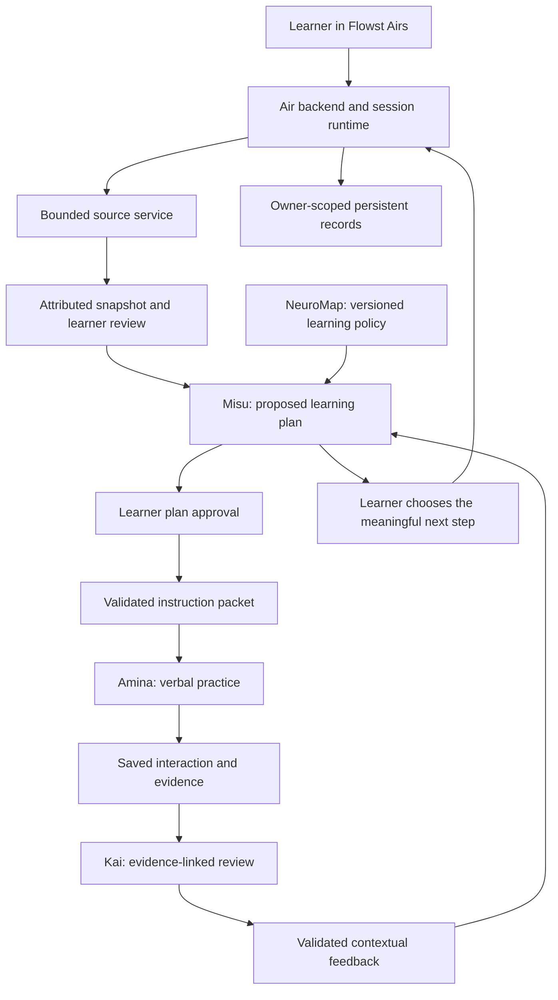

# Flowst Airs — product, system and agent responsibilities

Version: 0.2 responsibility clarification, 2026-10-04.
Status: target system design with an explicit implementation boundary. This document clarifies the supplied Flowst Airs v0.1 design; it does not claim that every proposed capability has shipped.

## Product identity

**Flowst** is the parent brand. **Flowst Airs** is the independent learning product. **Bring Your Source** is a learning journey within that product. **Misu, Amina and Kai** are specialist agents within the journey. **NeuroMap** supplies its versioned learning policy.

Amina is the verbal learning partner. Her name should not also stand for the product, source service, database, orchestration runtime, permission system or learning science architecture.

Product promise: bring material, understand it, explain it in your own words, and practise using the idea in a different situation. Feedback describes contextual evidence and uncertainty; completing an activity does not prove mastery or durable learning.

The product uses Flowst Airs in navigation, metadata, docs and package naming. Canonical study routes use /air, and source-service configuration uses AIR_* keys. Existing /amira links redirect to /air; old deployment keys are read as migration aliases. Persisted AMIRA and MIRO agent IDs remain compatible with existing records. The existing deployed Amina foundation remains distinguishable from new submission work.

## Responsibilities at a glance

| Layer | Owns | Does not own |
| --- | --- | --- |
| Flowst Airs product | Overall promise, learner journey, accessibility, learner controls and coherent presentation | A single agent personality or a claim that a model knows the learner's ability |
| Air backend/runtime | Identity, permissions, source processing, authoritative state, validated handoffs, persistence, quotas, provider jobs, failure recovery and audit traces | Instructional decisions made without approved policy or learner control |
| NeuroMap | Published mechanisms, strategies, interaction functions, evidence requirements, support rules and phase definitions | Authentication, billing, source fetching or learner diagnoses |
| Misu | Proposes objectives and instructional activities, selects permitted learning functions, proposes meaningful next steps and explains those proposals | Direct database writes, permission grants, paid-job dispatch, unilateral objective completion or Kai's evidence interpretation |
| Amina | Conducts the spoken interaction, follows the instruction packet, responds to the attempt, provides permitted clarification/hints and captures the exchange | Product ownership, independent plan replacement, formal learner scoring or unsupported longitudinal conclusions |
| Kai | Interprets recorded evidence, distinguishes observation/inference/recommendation, explains uncertainty and proposes practice needs | Conducting the main lesson, changing the plan, judging accent/personality/intelligence or persisting model conclusions without validation |
| Learner | Selects source/goal, reviews coverage, approves the plan, requests help, accepts or declines consequential changes, and controls stored learning information | Reviewing every minor conversational rephrase |

These are logical responsibilities. Separate agents do not require separate deployments, model accounts, or unrestricted tool access. They can share provider infrastructure while keeping different contracts, context and output validation.

## System structure

The UI is the learner's interface to Air, not a direct route to model permissions. Air's backend owns the session state machine and remains authoritative even when models recommend a change.

Air supplies each role only the context needed for the active task. Fetched source text and learner speech are data; they cannot override server instructions, source boundaries or permissions.

## Air's architectural services

### 1. Identity and access

Resolve the learner identity on the server; enforce ownership, entitlements, active-study restrictions, voice leases, approval and deletion rules. Model text cannot grant access or clear a gate. Operator settings govern provider availability and spending ceilings.

### 2. Source acquisition and grounding

Public document/repository/page/video adapters produce attributed text snapshots with stable references and available provenance. The learner reviews included material and omissions. Repositories are pinned to a commit; video references use transcript time ranges and explicitly exclude unobserved visuals. The snapshot stays stable during learning.

Air handles safe network destinations, size/duration/request limits, extraction failures and transcript-provider callbacks. Misu consumes the prepared snapshot; she does not log in to platforms or browse without bounds. The learner-facing transcription service starts a paid job and saves state; it is not a side-effect-free MCP read tool.

### 3. Instructional orchestration

The runtime retrieves the approved objective, policy version, available evidence and relevant preferences. Misu proposes the instructional choice. The runtime checks its schema, published function, source references, support limits, session state and allowed transition before executing it.

NeuroMap separates four policy layers: the cognitive mechanism (such as retrieval or self-explanation), pedagogical strategy (such as worked examples or guided inquiry), interaction technique (such as one question, a hint or teach-back), and evidence protocol (what recorded behavior and support would substantiate an observation). Published functions bind these layers into an executable contract. Misu selects within that policy; the backend compiles and validates the instruction packet.

The target progression is Activate → Model → Connect → Explain → Retrieve → Apply → Reflect. These are activity phases, not an ability ranking or a mandatory checklist. A session can revisit or omit phases when policy and learner choices support that decision.

Minor permitted rephrases and hints can occur within the active contract. A new objective, major strategy/difficulty change, consequential transfer activity or meaningful time extension must be visible and subject to the applicable learner controls. Independent learning removes educator approval; it does not remove learner approval.

### 4. Conversation and speech

Air manages microphone consent, live/recorded voice lifecycle, transcription, captions, reconnecting and usage. ElevenLabs supplies speech capabilities; Groq or the configured AWS Bedrock path supplies model inference. Providers are adapters, not owners of pedagogy or application state.

Amina follows the approved packet, asks one manageable question, listens to the attempt, offers permitted support and supports explanation/application. Immediate instructional clarification can remain conversational; Kai's structured feedback is the separate evidence interpretation step implemented for saved Airs attempts.

### 5. Evidence and feedback

The backend records the actual prompt, response, assistance, source references and execution trace. It must not invent hint counts, self-corrections, independence or evidence IDs from an agent's narrative.

Kai receives these saved records plus the objective and source context. Proposed dimensions are retrieval, explanation coherence, conceptual precision, reasoning, transfer, self-monitoring and prompt dependence. Findings must cite valid saved evidence, remain contextual and distinguish observed behavior from an interpretation or suggested action. Confidence numbers are not calibrated probabilities merely because a model emits them.

Misu uses validated Kai feedback to propose the next activity. Neither agent can independently mark the learner as mastered or commit a consequential progression change.

### 6. Memory and continuity

Air owns one authoritative, owner-scoped record system. DynamoDB holds application/session records; the existing S3 adapter handles configured document storage. Local fixtures use in-memory records. Agents receive selective views, not independent stores of unrestricted learner profiles.

- Source memory: approved snapshots, citations and provenance.
- Session memory: active objective/activity, policy, support and interaction history.
- Learning memory: objective-linked evidence across sessions, when implemented with learner controls.
- Verbal development memory: contextual patterns supported by multiple relevant sessions, not permanent intelligence or language labels.
- Preference memory: learner-selected pace, accessibility, captions and interaction preferences.

Longitudinal memory needs explicit retention, review, deletion and context rules before implementation. Data remains tied to source, objective, task, support and session. “Transfer” describes applying an idea in another context; it should not become a universal rank above “Independent.”

### 7. Operations and trust

Air owns validated provider responses, idempotency, reservations, cancellations, bounded retries, failure states and operational traces. Source ingestion and voice-practice allowances remain separate. An ambiguous paid dispatch must not automatically be repeated.

If a role fails, show what is actually saved and a real retry/fallback. A Kai failure must not produce fabricated feedback; a Misu failure must not silently change the approved plan. No secret belongs in learner-facing context or the development MCP environment.

## Agent handoff contracts

| Contract | Producer → consumer | Required boundary |
| --- | --- | --- |
| LearningInstructionPacket | Misu → runtime → Amina | Approved plan/objective and revision, allowed source IDs, published NeuroMap function/version, activity phase, permitted support/adaptations, evidence targets and stopping/fallback rules |
| LearningEvidencePacket | Recorded Amina interaction → backend → Kai | Saved turn/trace/source references, actual responses and support events; observations of what occurred, without invented assessment conclusions |
| LearningFeedbackPacket | Kai → runtime → learner/Misu | Evidence-linked observations, explicitly tentative inferences, suggested actions and uncertainty; no unauthorized transition |

Model outputs are proposals. The runtime validates them; server handlers perform authorized writes and provider actions. Packet names alone do not establish that separation.

## What the learner should see

The product header should identify Flowst Airs. Agent identity appears at the moment of contribution:

- Misu: plan preparation, plan explanation and proposed next activity.
- Amina: listening, speaking, guided explanation and application.
- Kai: an explicitly contextual evidence review, only when the service is implemented.

Source processing, permissions, storage and quota messages belong to the product. Do not attribute an extractor's work to Amina or show Kai as active before a feedback service exists. Surface concise decision explanations and inspectable evidence rather than fabricated private thought streams.

## Current slice versus target

| Area | Current standalone slice | Target addition |
| --- | --- | --- |
| Sources and review | Implemented bounded adapters, snapshots, review and attribution; paid/live provider checks still pending | Preserve the boundary; expand only with separate scope |
| Misu | Grounded objectives, approved versioned packets, visible planning presence and progression recommendations | Richer policy selection and continuing instructional orchestration |
| Amina | Verbal learning flow, hints, explanation/application and saved interaction evidence | Explicit evidence packets with reliably recorded support events |
| Kai | No separate learner-facing Kai evidence interpreter yet | Validated feedback service and evidence-review surface |
| NeuroMap | Published explicit-instruction and teach-back contracts with three current stages | Four policy layers, richer interaction catalog and seven activity phases |
| Memory | Source, conversation, preferences and execution/evidence records | Learner-controlled cross-session learning and verbal-development views |
| Brand | Flowst Airs headers, metadata, onboarding, /air routes and AIR_* configuration; Amina remains the verbal agent | Confirm the deployed environment and public URL after release |

Full Air orchestration requires separating the current combined conversation/feedback path and Misu progress review. A brand change alone is not that refactor. Preserve stored conversations, citations, approval and voice safeguards during the migration.
