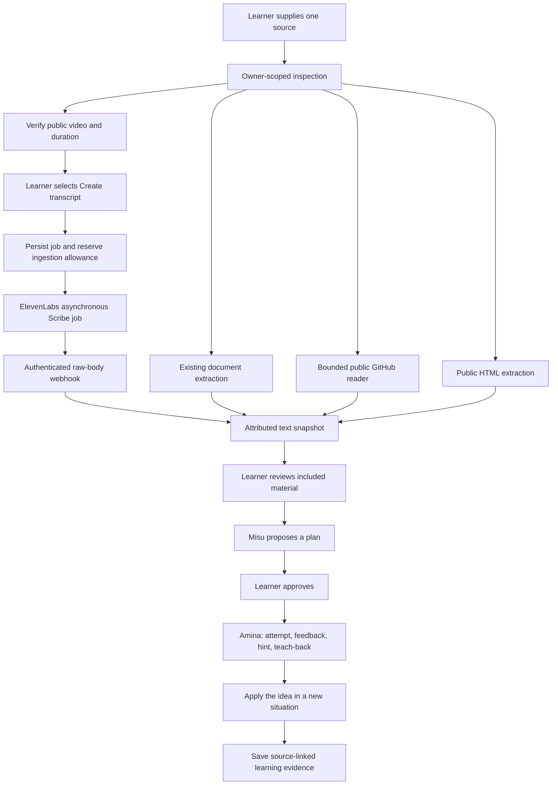

# Flowst Airs slice — implemented source and learning architecture

This describes the current implementation. [Flowst Airs system design](flowst-air-system-design.md) separates product ownership, backend responsibilities, NeuroMap and the Misu/Amina/Kai roles, and identifies target capabilities still pending. Amina is the verbal learning agent, not the name of every architectural service.

## Storage and ownership

Adapters return `MaterialExtraction` sections with stable local IDs and provenance. The existing section/chunk pipeline retains document compatibility and adds repository line locations or transcript time ranges. Confirming a draft creates a conversation whose ID equals its server-created draft ID, so retrying confirmation returns the same saved conversation. Planning and tutoring read that approved snapshot; they do not refresh or browse the original source.

Drafts are owner-scoped and expire after 30 minutes. DynamoDB stores compressed payloads with revision checks and TTL. GitHub preparation is claimed before retrieval. Video reservation atomically writes the job, per-account daily allowance, concurrent-job slot, and estimated operator spending reservation before contacting ElevenLabs. Uncertain dispatch is never automatically repeated. A signed callback must match the server-owned nonce and provider request ID; duplicate, early and late callbacks cannot revive a cancelled draft.

## Retrieval limits

| Input | Bound |
| --- | --- |
| Documents | Existing PDF/DOCX/PPTX limits; standalone upload at most 4 MB |
| GitHub | Public repository, pinned commit, 12 selected files, 64 KiB/file, 100,000 extracted characters, 16 API requests |
| Discovery | 2 MiB tree response, 2,000 candidates, explicit incomplete-discovery notice |
| HTML | One public HTTPS page, 3 redirects, 2 MiB compressed and decompressed, 100,000 characters, 20-second retrieval deadline |
| Video | Exact public video identity and duration verified before dispatch; completed video at most 30 minutes; 100,000 transcript characters |
| Drafts/ingestion | 5 inspections per 10 minutes, 1 concurrent video job, 2 paid submissions/account/UTC day, configured operator ceiling |

HTTPS retrieval rejects private/reserved addresses, verifies all DNS answers, pins the selected address, and rechecks redirects. It never executes downloaded scripts or repository code. GitHub imports exclude symlinks, submodules, credentials, generated dependencies and binaries. Public video metadata is parsed as JSON without evaluating platform scripts; unverifiable metadata produces a supplied-transcript fallback.

## Two permission boundaries

The production app uses the GitHub reader directly. Its development-only stdio MCP exposes exactly `get_repository`, `get_source_revision`, `list_study_files`, and `read_study_file`, with `readOnlyHint: true`. The launcher keeps application provider secrets out of its environment. The example Codex configuration allows only those tools and requests approval for writes. There are no mutation, shell, generic HTTP, or arbitrary filesystem tools.

Video transcription is a paid, state-changing learner action and is not an MCP read tool. The learner selects it explicitly. Its accounting is separate from voice practice. Application estimates use an operator-configured rate; a provider-side credit limit supplies an independent billing control.

Fetched passages, including README/AGENTS text or spoken instructions, are untrusted learning data. They are separated from server-owned teaching instructions. Misu's citation IDs are validated against stored sections; Amina receives the approved objective, prior question, and bounded source context. Video context explicitly excludes unobserved visuals. Existing approval, assessment, progression, voice-session and deletion gates remain in force.

See `VALIDATION.md` for actual evidence and `DEPLOYED_VIDEO_CHECKLIST.md` for the owner-run live checks. Fixture plans are labelled demonstrations; they are not evidence that Groq, ElevenLabs, or a microphone session has been exercised.

## Misu planning presence

Misu is the public name of the existing planner (legacy MIRO IDs and internal function names remain compatible). Her avatar and role appear before approval and in the session plan panel. Plan preparation, approval saving, and recommendation review use actual request and persisted plan states. The plan-basis disclosure presents saved learner preferences, source references, and the approved versioned teaching approach; it does not expose or simulate model chain of thought. Recommendations expose their saved review checkpoint and up to five recent objective attempts used in that review. Kai’s separate interpretation service and the full Air orchestration remain pending.

New plans request a bounded, learner-facing planningNote for each objective, displayed with the outcome and source citations. It is a model-generated proposal explanation for review, not verified learner evidence. Older saved objectives without it remain usable.
